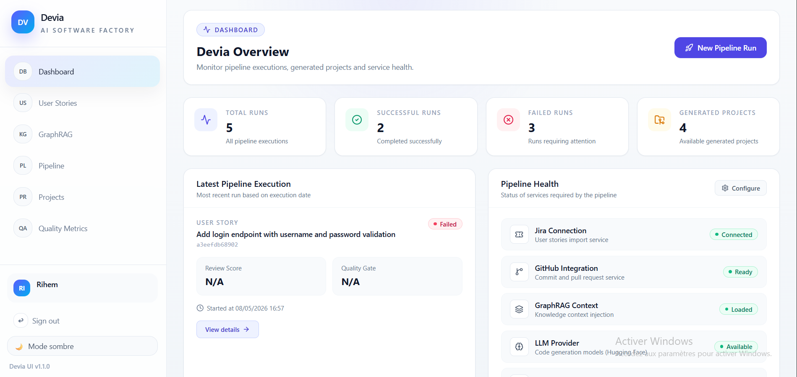
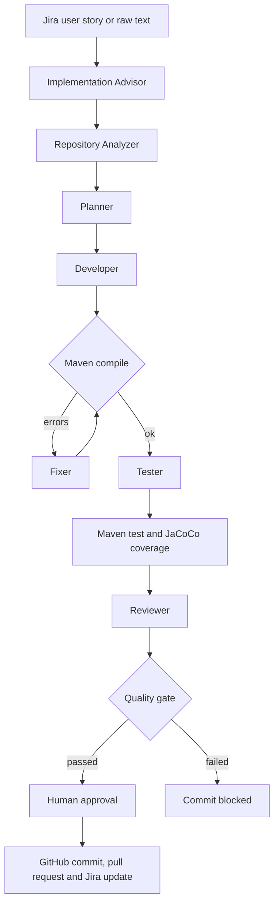
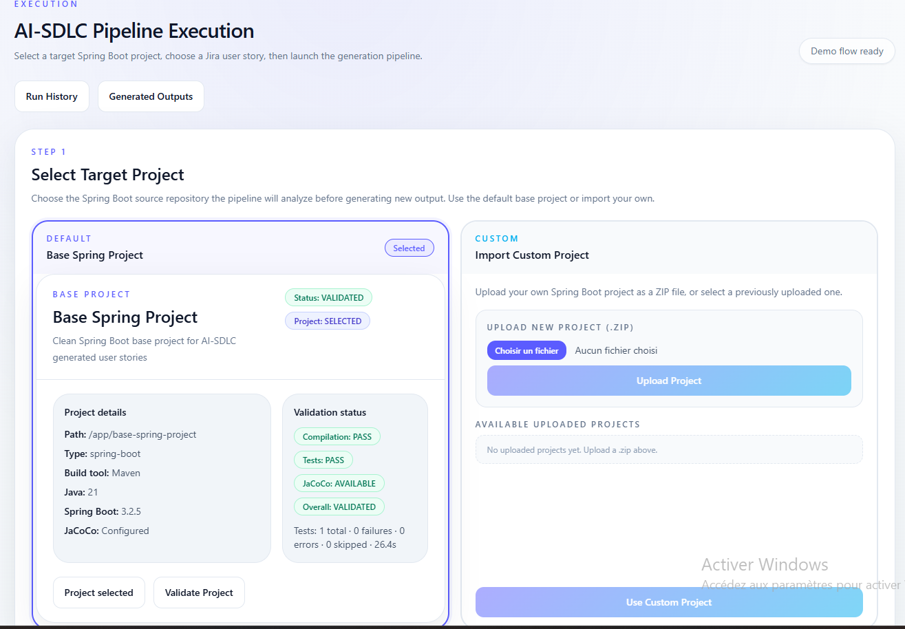
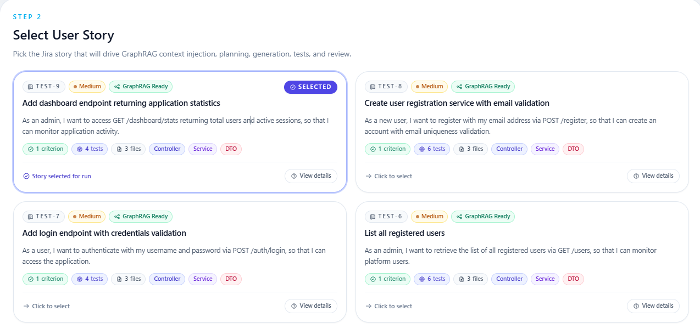
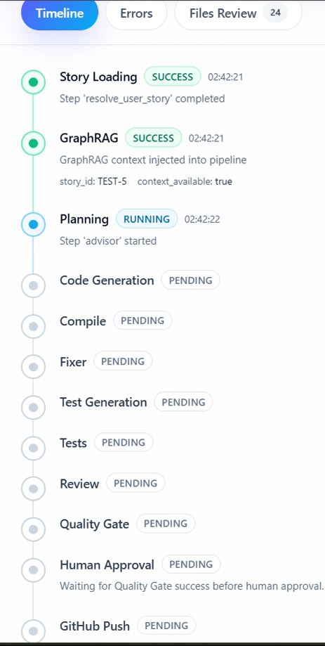
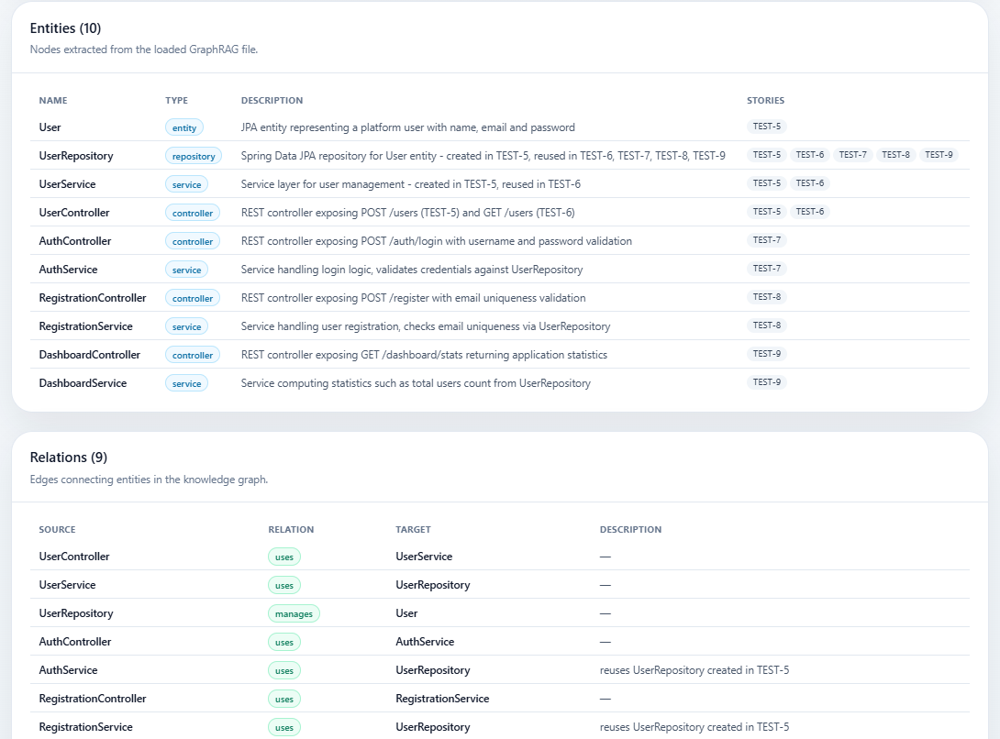

# Devia — Multi-Agent AI Platform for Automated Software Development

Devia turns a Jira user story into a compiled, tested and reviewed Java Spring Boot application. A pipeline of seven specialized AI agents analyses the story, plans the work, generates the code and its tests, fixes build errors and reviews the result, while a React interface lets you supervise each run in real time.

Final-year engineering project (ENIT), carried out at Talan Tunisia from February to June 2026.



## How it works



## The seven agents

| Agent | Role |
|---|---|
| Implementation Advisor | Analyses the user story and the documentation, then defines entities, REST endpoints, Gherkin scenarios and an implementation plan |
| Repository Analyzer | Indexes the target repository and identifies the files and patterns relevant to the story |
| Planner | Breaks the work into small, scoped subtasks and decides which ones can run in parallel |
| Developer | Generates the business code: JPA entities, repositories, DTOs, services and REST controllers |
| Fixer | Loops on build and test errors, delegating corrections to the Developer until the project compiles |
| Tester | Validates and repairs the generated JUnit tests |
| Reviewer | Reviews the code for bugs, SOLID violations, security issues and Spring Boot conventions, and returns a score |

## Key design choices

- **Deterministic where possible:** boilerplate code (application class, configuration, exception handling, `pom.xml`) is produced by a Python template engine, without any LLM call.
- **Real metrics instead of LLM estimates:** coverage comes from JaCoCo and test results from Maven; a failed quality gate blocks the commit.
- **Multi-provider LLM access with automatic fallback:** Azure AI Foundry, then Groq, Mistral and Hugging Face.
- **GraphRAG context:** a knowledge graph of the project gives the agents the files, tests and dependencies related to a story.
- **Parallel and resumable runs:** independent subtasks run concurrently, and the pipeline state is checkpointed after each step so a run can be resumed.
- **Deterministic quality analysis** alongside the LLM review: duplicated code, complex methods, security hotspots and skipped tests.
- **Human in the loop:** once the quality gate passes, the generated files are reviewed and approved by a person before anything is pushed to GitHub.

## Supervision interface

The React application provides a live view of the pipeline (events streamed from the backend), run history, logs and errors, a quality center, a file-by-file review of the generated code before commit, a GraphRAG explorer and the Jira and GitHub integration settings.

| Select the target project | Select the user story |
|---|---|
|  |  |

| Live pipeline | GraphRAG knowledge graph |
|---|---|
|  |  |

## Tech stack

- **AI:** LLM agents (Azure AI Foundry, Groq, Mistral, Hugging Face) · GraphRAG
- **Backend:** Python · FastAPI · SQLAlchemy · PostgreSQL · JWT authentication
- **Frontend:** React · Vite · Tailwind CSS · TanStack Query
- **Generated code:** Java 21 · Spring Boot · Maven · JUnit 5 · JaCoCo
- **DevOps:** Docker · Jenkins · SonarQube · Azure App Service · Prometheus · Grafana
- **Integrations:** Jira · GitHub

## Project structure

```
agents/                the seven agents and the Jira / GitHub clients
core/                  pipeline orchestrator, template engine, Maven runner, quality analysis, GraphRAG loader
api/                   FastAPI application (routes, services, database models)
frontend/              React supervision interface
base-spring-project/   Spring Boot base project used as generation target
jenkins/, Jenkinsfile  CI/CD pipeline
monitoring/            Prometheus configuration
tests/                 API tests
```

## Getting started

Prerequisites: Docker and an API key for at least one LLM provider.

1. Clone the repository:
```bash
git clone https://github.com/rihem-khouildi/devia-multi-agent-platform.git
cd devia-multi-agent-platform
```
2. Create your configuration file and fill in your keys:
```bash
cp .env.example .env
```
3. Start the platform:
```bash
docker compose up --build
```
4. Open the interface at `http://localhost:5173`. The API runs on `http://localhost:8000`.

To start monitoring (Prometheus on port 9090, Grafana on port 3000):
```bash
docker compose -f docker-compose.monitoring.yml up -d
```

The pipeline can also be run from the command line:
```bash
python main.py SCRUM-7 --dry-run
```

## CI/CD

The Jenkins pipeline runs a SonarQube analysis, builds and pushes the Docker images, deploys them to Azure App Service and checks the health of the deployed backend.

## Author

**Rihem Khouildi** — [GitHub](https://github.com/rihem-khouildi)